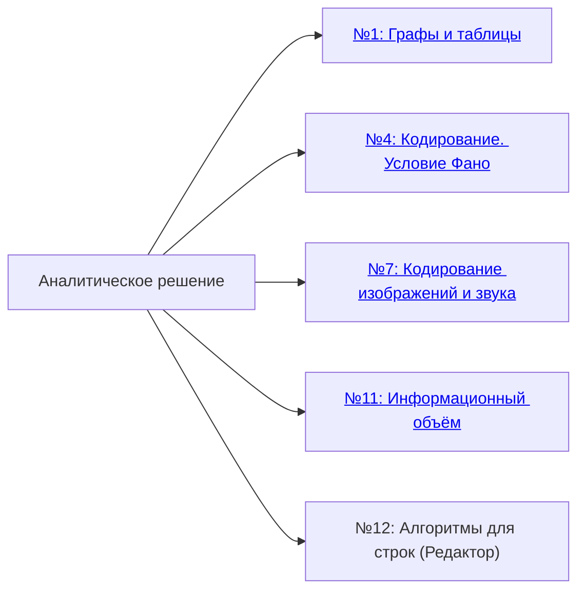
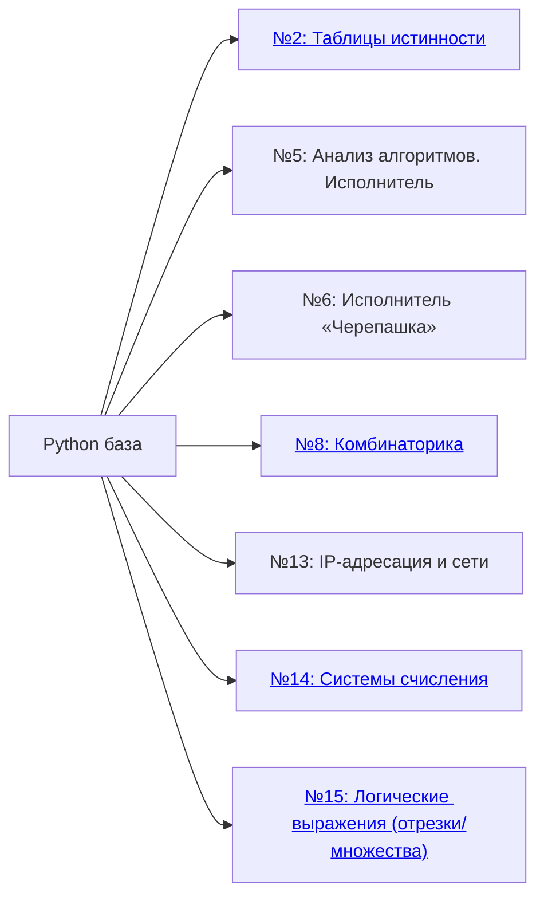
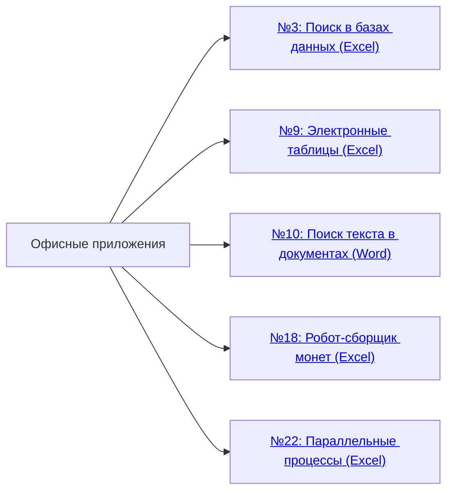
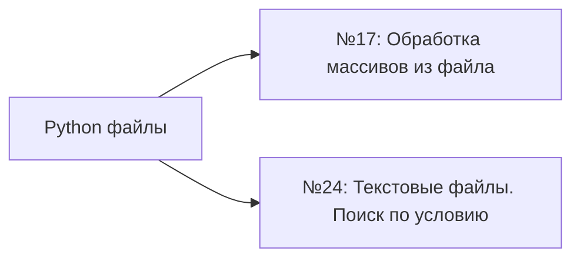
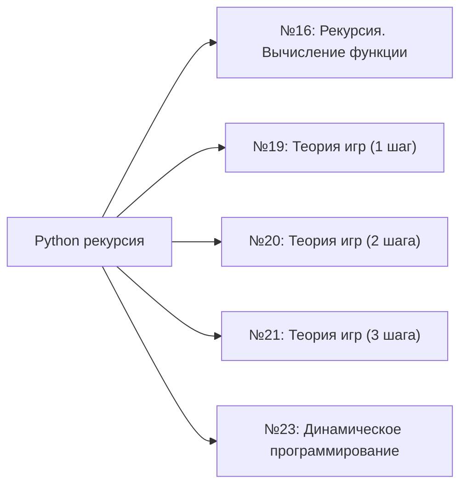
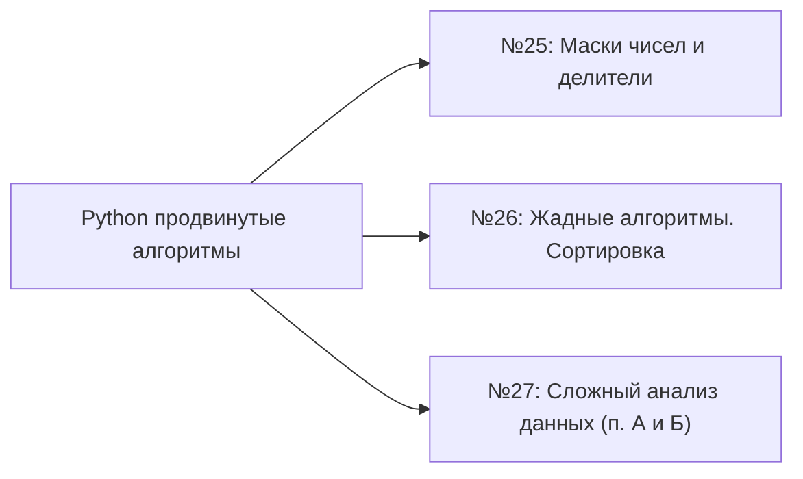

# ЕГЭ. Информатика. Описание заданий

Краткое описание заданий КИМ, рекомендуемое время и шкала перевода баллов.

## 1. Структура экзамена и описание заданий

### Часть 1. Краткий ответ (число или слово)

Ответом является **целое число** или слово.
**Баллы:** 18 (по 1 за задание). **Время:** около 1,5 часа.

| № | Тема | Что нужно уметь | Балл | Время |
|:---:|:---|:---|:---:|:---:|
| 1 | Информационные модели. Графы и таблицы | Декодировать сообщения, находить длину маршрута в графе по таблице | 1 | 3 мин |
| 2 | Таблицы истинности. Логические выражения | Строить таблицу истинности и определять порядок переменных в ней | 1 | 3 мин |
| 3 | Поиск в базах данных | Фильтровать данные в `.ods`-таблице, применять ВПР, считать суммы и средние | 1 | 3 мин |
| 4 | Кодирование. Условие Фано | Строить кодовое дерево, проверять выполнение условия Фано, вычислять длины кодов | 1 | 2 мин |
| 5 | Исполнитель. Формальные алгоритмы | Выполнять команды формального исполнителя или восстанавливать исходные данные алгоритма | 1 | 4 мин |
| 6 | Анализ алгоритмов. Трассировка | Трассировать программу вручную и найти результат её выполнения | 1 | 4 мин |
| 7 | Кодирование изображений и звука | Вычислять объём файла по разрешению, глубине цвета, частоте дискретизации | 1 | 5 мин |
| 8 | Количество информации. Комбинаторика | Применять правило произведения, считать число кодовых слов или паролей | 1 | 4 мин |
| 9 | Электронные таблицы | Записывать формулы LibreOffice Calc: СУММ, ЕСЛИ, СЧЁТЕСЛИ, СРЗНАЧЕСЛИ, МАКС | 1 | 6 мин |
| 10 | Поиск подстрок в тексте | Подсчитывать вхождения подстроки в тексте средствами текстового процессора | 1 | 3 мин |
| 11 | Объём памяти. Кодирование символов | Вычислять размер файла паролей/идентификаторов через мощность алфавита и длину | 1 | 3 мин |
| 12 | Алгоритм «Редактор» для строк | Исполнять алгоритм для формального исполнителя с фиксированным набором команд | 1 | 6 мин |
| 13 | IP-адресация. Маска подсети | Находить адрес сети, количество хостов, диапазон адресов по IP и маске | 1 | 3 мин |
| 14 | Системы счисления | Переводить числа между системами, считать единицы/нули в двоичной записи | 1 | 3 мин |
| 15 | Логические выражения. Числовые условия | Перебрать значения, при которых логическое выражение истинно (делимость, диапазон) | 1 | 3 мин |
| 16 | Рекуррентные выражения. Вычисление функции | Вычислять значение рекуррентно заданной функции, применяя её определение последовательно | 1 | 5 мин |
| 17 | Программирование. Обработка числовых последовательностей | Написать программу (10–15 строк) обработки числовой последовательности из файла | 1 | 14 мин |
| 18 | Электронные таблицы. Целочисленные данные | Использовать `.ods`-таблицу для обработки целочисленных данных (робот-сборщик монет) | 1 | 8 мин |

### Часть 2. Программа на Python или другом языке

Необходимо написать **рабочую программу**, файл сдаётся в системе.
**Баллы:** 11. **Время:** около 2 часов.

| № | Тема | Что нужно уметь | Балл | Время |
|:---:|:---|:---|:---:|:---:|
<<<<<<< HEAD
| 19 | Побитовые операции. Маски | Писать программу перебора чисел с побитовыми условиями (`&`, `^`, `>>`, `<<`) | 1 | 10 мин |
| 20 | Передача данных. Объём и скорость | Считать размер, время передачи или степень сжатия по формулам | 1 | 8 мин |
| 21 | Алгоритмы на графах | Реализовать обход или поиск кратчайшего пути (BFS/DFS или перебор) | 1 | 15 мин |
| 22 | Вычислительные процессы. Зависимости | Построить граф зависимостей, вычислить критический путь и минимальное время выполнения | 2 | 20 мин |
| 23 | Сложный перебор. Комбинаторика | Написать программу полного перебора (itertools.product или вложенные циклы) | 1 | 15 мин |
| 24 | Логические выражения. Поиск решений | Перебрать все значения, при которых сложное логическое выражение истинно | 1 | 15 мин |
| 25 | Сложные программы. Анализ и написание | Написать программу, реализующую нетривиальный алгоритм (разбор числа, строки) | 1 | 20 мин |
| 26 | Теория игр. Оптимальная стратегия | Найти выигрышные позиции в игре двух игроков методом рекурсии или ДП | 2 | 25 мин |
| 27 | Сортировка, поиск, обработка данных | Написать программу с файловым вводом, обработкой строк чисел и подсчётом по условию | 2 | 25 мин |
=======
| 19 | Теория игр. Анализ алгоритма (1 шаг) | Анализировать алгоритм логической игры, определять выигрышные/проигрышные позиции | 1 | 6 мин |
| 20 | Теория игр. Выигрышная стратегия (2 шага) | Строить позиции на 2 шага вперёд, находить выигрышную стратегию | 1 | 8 мин |
| 21 | Теория игр. Дерево игры (3+ шага) | Строить полное дерево игры по алгоритму, находить выигрышную стратегию | 1 | 11 мин |
| 22 | Вычислительные процессы. Параллельные системы | Строить граф зависимостей, вычислять критический путь и минимальное время выполнения | 1 | 7 мин |
| 23 | Анализ хода исполнения алгоритма | Трассировать программу, определять результат или количество выполнений цикла | 1 | 8 мин |
| 24 | Программирование. Обработка символьной информации | Написать программу (10–20 строк) для обработки строк и текстовых данных из файла | 1 | 18 мин |
| 25 | Программирование. Обработка целочисленных данных | Написать программу (10–20 строк) для обработки целочисленных данных из файла | 1 | 20 мин |
| 26 | Сортировка. Обработка целочисленных данных | Написать оптимальную программу сортировки и обработки целочисленных данных | 2 | 35 мин |
| 27 | Анализ данных. Построение и преобразование модели | Реализовать полный цикл анализа данных: чтение, очистка, построение модели, интерпретация | 2 | 40 мин |
>>>>>>> a1cc898 (upd)

**Итого:** 27 заданий, **29 первичных баллов**, **3 ч 55 мин** (235 мин).

---
## 2. Папки по подтемам заданий

### 2.1. Аналитическое решение

Решаются вручную, требуют понимания теории и формул. Программирование не нужно.

### 2.2. Python база (циклы, строки, списки)

Базовые конструкции Python: циклы, строки, списки, условия.

### 2.3. Офисные приложения (Excel, Word)

Работа с таблицами и документами в LibreOffice/OpenOffice.

### 2.4. Python файлы

Чтение и обработка данных из файлов.

### 2.5. Python рекурсия

Рекурсивные алгоритмы и динамическое программирование.

### 2.6. Python продвинутые алгоритмы

Сложные задачи на оптимизацию и обработку больших данных.

---
## 3. Шкала перевода первичных баллов в тестовые (100-балльная шкала)

| Первичный балл | Тестовый балл |
|:---:|:---:|
| 1 | 6 |
| 2 | 11 |
| 3 | 17 |
| 4 | 23 |
| 5 | 29 |
| 6 | 36 |
| 7 | 42 |
| 8 | 48 |
| 9 | 54 |
| 10 | 60 |
| 11 | 64 |
| 12 | 68 |
| 13 | 72 |
| 14 | 76 |
| 15 | 78 |
| 16 | 80 |
| 17 | 82 |
| 18 | 84 |
| 19 | 86 |
| 20 | 88 |
| 21 | 90 |
| 22 | 92 |
| 23 | 94 |
| 24 | 95 |
| 25 | 96 |
| 26 | 97 |
| 27 | 98 |
| 28 | 99 |
| 29 | 100 |

---
## 4. Ссылки

[Яндекс Учебник. СПбПУ — Группа 511](https://education.yandex.ru/teacher-ege/inf/join?token=gAAAAABpi5pL6-7VLMuVOWbIzkuLNh7iBnfdiiQUPjk-fLCRQoVvqPjRBY_AGAqOHXPQkF7nHKgZamu0r0V4PkjXK4RK3nN2XCbpY9hGNueGgfM0pURBhCUNSmzfxA9Im7mSROmktuaKGwMv_dj1A37UgqUKjxCqRWtMXhHdHi8lS8563gaUzxv8vz_Cj3YGyAxc--86zmX1wvinyZ8tNLt-y6WGtLZvgA==)

[Яндекс Учебник. Персональные занятия](https://education.yandex.ru/teacher-ege/inf/join?token=gAAAAABpi4GuAtw9o40C_BRHyyVCM-CU0SsUC0Zc4JyOTeHjRFh9VTobnY2WLc4kpf6pAm6FwpkXBmXWVsne0C5f0Yg_dsVKIccP8L6otSqgtuBorrf-sxkIM4x2i4vhbAKye3wByzC6EMumFN9hFHATk7Sn3YsLAY2TWDxT99Rwqije9_NkdRhyZpHCWX_Iqpzfv3NA6CbvdTioS21Sthz-3ANPYdiuiA==)

[Python для ЕГЭ: полный справочник](./Python_для_ЕГЭ.md)

---

**Основано на:** КИМ ЕГЭ 2026, спецификация ФИПИ, открытый банк заданий.
